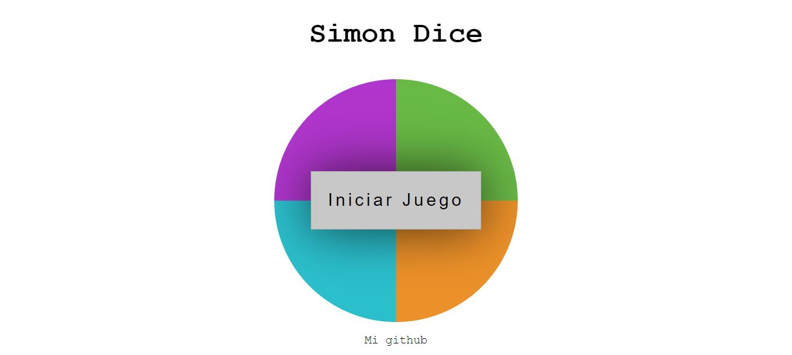

# Simon-Dice

Este es un proyecto hecho en: **HTML** **CSS** Y **JS** con el fin de repasar los conceptos basicos del lenguaje javaScript , fue hecho con mis conocimientos adquieridos en **Platzi**

